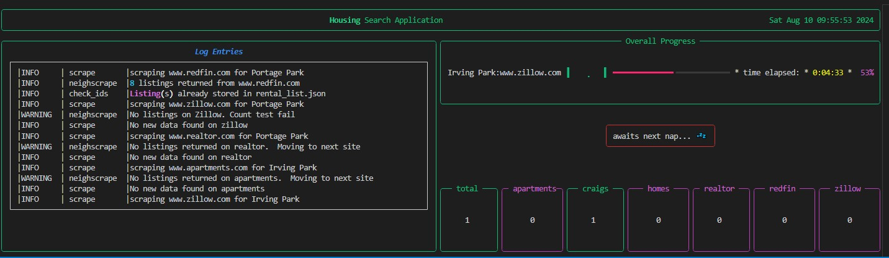
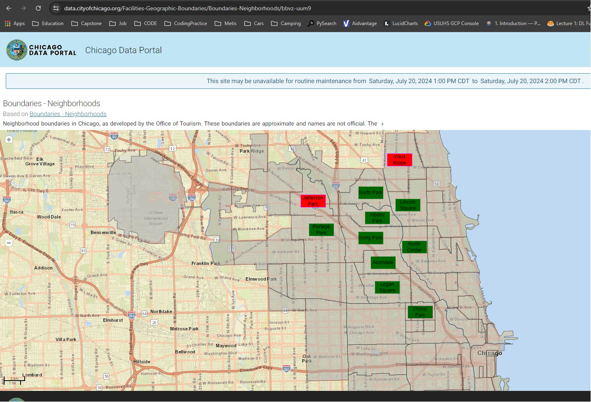

<h1 align="center">
  <b> Housing Search Tool </b> 
</h1>

This repo is meant to coalesce different housing resources to aide in searching for housing in Chicago.  The aim is to build a dataset of available housing in chicago, then search twice daily for new listings.  If a new listing is found, an email is sent to the user. 
Datasets are kept in the data folder.

### Base Python Requirements
- Python >= 3.11

### Required Libraries
- Found in the requirements.txt file
- ipykernel installs a bunch of crap for me to use with python interative in VSCode.  
- Basic libraries are:
  - BeautifulSoup - (I know i know.  But its the best way to parse html)
  - lxml
  - matplotlib
  - Numpy
  - Pandas
  - requests
  - Rich
    

### Other Requirements
- In order to use the email functionality, you need to create a dummy account on gmail. 
- Once you do, authorize it for 2step authentication. 
- Generate an App password for the account
- Store credentials in a text file under a `/secret` folder you'll need to create.
  
### Workflow - Rewrite
1. Main file will run indivdiual sub scripts for each source.  (Makes failure tracing easier)
2. For each source, pull off relevant info for each listing.  
   - Makes sure to use info that's common to all sources. 
   - Store any extra data you find in a text field
   - Craigs is the only one you have to load each individual link. As not all their 
     information is stored on the front page.
3. After each site / neighborhood retrieval.  Score the listings for these traits
   - Closest train stop
   - Crime score
4. Send support email with any new links that aren't saved already. 
   

### Sites to search
- [x] - [apartments](https://www.apartments.com)
- [x] - [craigslist](https://www.craiglist.org)
- [x] - [homes](https://www.homes.com)
- [x] - [realtor](https://www.realtor.com)
- [x] - [redfin](https://www.redfin.com)
- [x] - [zillow](https://www.zillow.com)

### Runtime Sample

Your terminal should look something like this during runtime.  It is a [rich](https://rich.readthedocs.io/en/stable/) live display that shows you the following information.

1. Log table of all log messages letting you know whats happening during runtime
2. Overall progress timer
3. Server naps progress timers (because always be nice to the servers)
   - Other information will sometimes pop up here if the program is requesting additional GPS or city crime information
4. A total and individual site counters for listings found. 
   - The border color will change for each counter depending on what information has been found.
   - ${\color{red}Red \space = \space No \space listings \space have \space been \space found.}$ 
   - ${\color{green}Green \space = \space a \space new \space listing \space has \space been \space found.}$
   - ${\color{magenta}Magenta \space = \space A \space listing \space has \space been \space found \space but \space already \space exists \space in \space your \space JSON \space container.}$

### External Data Sources
- [CTA L stops](https://data.cityofchicago.org/Transportation/CTA-System-Information-List-of-L-Stops/8pix-ypme/data)
- [CTA Crime data](https://data.cityofchicago.org/Public-Safety/Gun-Crimes-Heat-Map/iinq-m3rg)
    
### Current Search Area

Currently the software is set to search the following neighborhoods.  These can be adjust by adding/commenting out the `AREAS` variable in `main.py`

